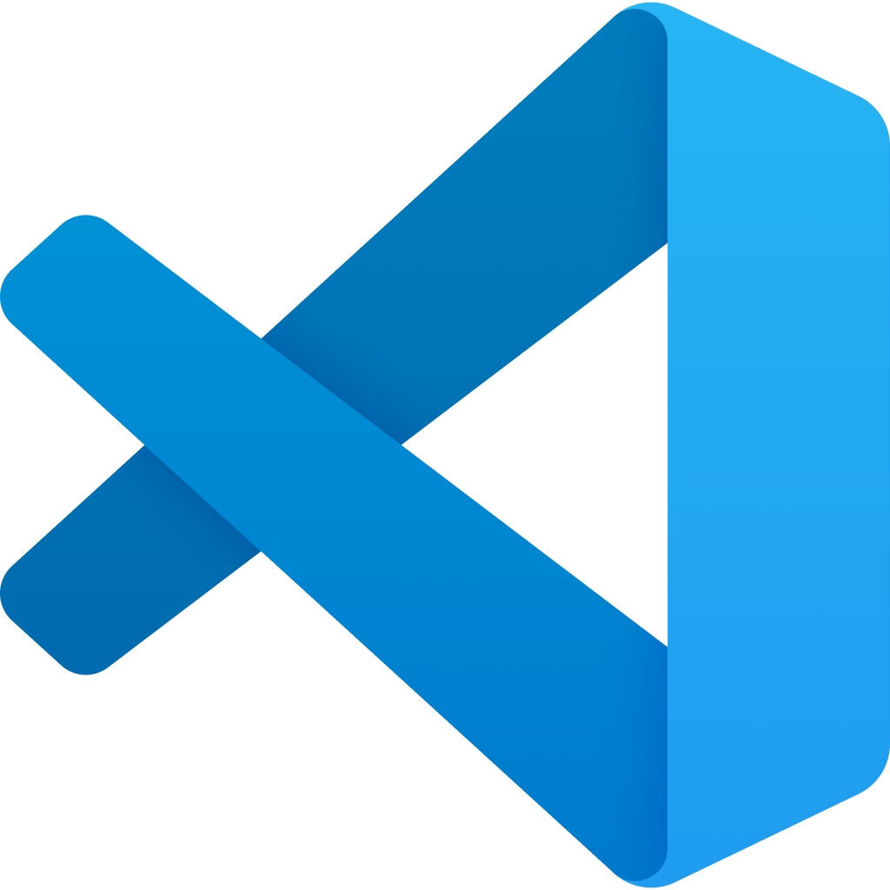

# 🛠️ Melhores Editores de Texto para Terraform
## ✅ 1. VS Code (Visual Studio Code) — o queridinho da galera


### Por que usar:
- Leve, rápido e **super extensível**
- Integração com Git, Docker, Terraform, AWS, etc.
- Suporte a snippets, autocompletar, lint, formatação automática

### Extensões recomendadas para Terraform:
| Extensão                                | O que faz                                                       |
|-----------------------------------------|------------------------------------------------------------------|
| **HashiCorp Terraform**                 | Syntax highlight + validação                                    |
| **Terraform Auto-Complete**             | Sugestões automáticas                                           |
| **Prettify Terraform**                  | Formatação de arquivos `.tf`                                    |
| **AWS Toolkit**                         | Integração com AWS direto do VS Code                            |
| **YAML, JSON, Markdown All in One**     | Suporte a arquivos auxiliares                                   |


## 💡 Dica: VS Code com DevContainers
Você pode configurar um ambiente com Docker e Terraform prontos usando `.devcontainer` — ideal pra times.

## 🧪 Exemplo de configuração .vscode/settings.json:
json
```
{
  "terraform.formatOnSave": true,
  "editor.formatOnSave": true,
  "editor.defaultFormatter": "HashiCorp.terraform"
}
```